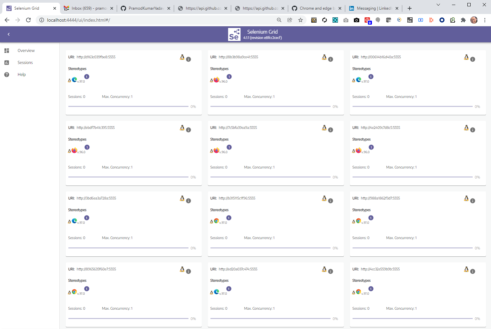

# pigeon
Pigeon is an open source, powerful, feature rich, frontend test automation framework in Selenium, Docker, Elastic and Kibana.
Application under test is FedEx browser application home page.

NOTE: Although originally I made this as an assignment, I think this repo contains a lot of good stuff that can be used/reused by 
anyone to create production grade frameworks. Thus I decided to make it open for all :). Happy learning and happy testing!


## Toolset
Key tools used in pigeon are:
- [x] **ElasticSearch and Kibana** (for real time test monitoring and reporting)
- [x] **Github actions** (for continuous integration)
- [x] **Docker** (for dockerizing the project and running it in a docker selenium grid)
- [x] **Remote execution on docker selenium grid** (example of remote execution)
- [x] **Selenium**  (library for browser automation)
- [x] **Java** (as the core programming language)
- [x] **Maven** (for dependency management)
- [x] **Junit 5** (for assertions)
- [x] **Typesafe** (for application config)
- [x] **Surefire** (for secondary xml reports in CI)
- [x] **Surefire Site plugin** (for secondary html reports in CI)
- [x] **Github** (for version control)
- [x] **Faker library** (for generating random test data for different locales - germany, france, netherlands, english)

### Exceptions (earlier - not anymore an exception)
Originally after informing/asking `Mark Vieillevoye` on email to allow to deviate from using Cucumber, I created the 
original framework using Selenium - Junit5. However, when mark said that it is desired to use Cucumber for this assignment, 
I also created tests using Selenium - Cucumber. That is the reason, why you will see two implementations for the same 
underlying tests, done using both Cucumber and Junit5. My original reasons for not using Cucumber were below:
  - **Impact on execution times**: The maximum level of parallel execution that can be achieved in cucumber is at a feature file 
    level. This limits the total execution time to tool choice rather than an infrastructure limitation. By avoiding 
    cucumber, we can get faster build times in CI by upgrading to a powerful infrastructure - something that we cannot 
    do with cucumber, even if we have high infrastructure. Cucumbers feature-files are the slowest moving parts. However,
    with Junit5 the slowest moving part is a test case.
- **Impact on maintenance and design**: Cucumber breaks the atomic nature of a test to provide "arrange/act and assert" 
    and rather puts that in the feature files. This takes all the context of items in the classes away and puts it into 
  feature files. Simple things like extending classes are not allowed in step definitions, and you cannot make efficient 
  use of beforeEach and afterEach, beforeAll, afterAll annotations. We now rather deal with class level before and 
  after methods. The way hooks are used, are not intuitive and in general reducing every line, into a step method is 
  counter productive. The sugar syntax that Cuucmber provides, is all eventually coming from underlying libraries (such 
  as Junit) and once you know how to make good use of it, you can write equally readable tests with much less boiler 
  plate code and without losing any context. 
  
## Key framework features
- [x] **All tests to be atomic and independent**.
    - Reason: When we run our tests in parallel, we do not want the result of one test affect another one.
      This allows us to finish a lot of tests in a very short time - depending on the test infrastructure we have got.
- [x] **Run tests in parallel**.
    - Reason: Faster feedback time.
- [x] **Run tests as a part of new pull requests in CI pipelines**.
    - Reason: We would like to catch regression issues 'before' they are merged in the stable develop branch and not 
      'after'. Running our test framework as a part of CI pipeline, when new pull requests are created, allows tests to 
      run "on time" and help us prevent breaking changes from merging into develop. Goal is, if we can finish our 
      tests faster than a developer can review, we have designed a efficient framework. 
- [x] **Readable tests**.
    - Reason: It is said that it takes 20% of efforts to create tests and 80% in reviewing/maintaining them. It is thus only 
      reasonable to have highly readable tests with minimum or zero duplication. We achieve this by having a clear 
      separation of concerns between test intentions and test implementation code.
- [x] **Scalable**. 
  - Reason: With time the application will grow in size and complexity. The framework design should allow for easy
    scalability without affecting existing entitites. We achieve this by using more `composition` than `inheritance` in 
    our design. Also by keeping a clear seperation between code, config, data and test intentions.
- [x] **Multiple parallel execution modes**.
    - Reason: To scale up or down execution based on the infrastructure availability.
- [x] **Logging**.
  - Reason: To allow logging at multiple levels (debug, warn, err) for multiple needs (debug, execution)

## Getting started

## To run tests from docker
### Open powershell terminal or any other terminal
-  `cd D:\pigeon\`
-  `docker image build -t pigeon . -f Dockerfile`
-  `docker container run pigeon`
    
## To run tests on localhost
### via Intellij or from Maven
- To include any specific tests, (say to run only smoke tests in CI), run as:
    - `mvn clean -Dgroups=smokeTest test`
- To exclude any flaky or slow tests, you can run as: 
    - `mvn clean -DexcludedGroups="slow, flaky" test`

## To run tests on remote (say on docker.selenium.grid)
### via Intellij or from Maven
- Precondition: Verify that HOST_URI="http://localhost:4444/wd/hub" is set in host.docker.selenium.grid.conf.
- First bring up the selenium grid infrastructure. To do this:
- Start Docker Desktop (if on Windows or linux)
- To start Docker in Swarm mode, you need to run `docker swarm init`
- To deploy the Grid, `docker stack deploy -c docker-compose-v3-swarm.yml grid`
- Verify that the stack is up by `docker stack ls`.
- Verify that the services and replicas are up by `docker service ls`.
- [Verify docker grid sessions](http://localhost:4444/ui/index.html#/)
  - 
- You can run tests on only three browsers (edge, chrome or firefox). Edge and chrome tests are stable.
    - `mvn clean -DBROWSER=edge test`
    - `mvn clean -DBROWSER=chrome test`
- Once done, Stop with `docker stack rm grid`
- Verify that the stack is down by `docker stack ls`.
- Verify that the services are down by `docker service ls`.
- Stop swarm mode `docker swarm leave --force`

### Troubleshooting. 
- If the sessions are stuck, it is probably because the driver did not properly quit. 
- Bring down the stack as explained above and bring up the stack again.

## Monitoring (using Elastic and Kibana)
- Go to choices.conf file and set MONITORING_INFRA_READY_ON_ELASTIC_KIBANA = "true"
- Start Docker Desktop (if on Windows or linux)
- Open a terminal (as admin)
- [Increase the vm map count as explained here](https://www.elastic.co/guide/en/elasticsearch/reference/current/docker.html#_windows_with_docker_desktop_wsl_2_backend)
- CD to this project root `cd D:/pigeon`
- Run `docker compose -f .\docker-compose-monitoring.yml up` to start all elastic and kibana containers. 
- Go to elastic search home page `http://localhost:9200/` 
- You should see something like this.
```
{
  "name" : "es01",
  "cluster_name" : "es-docker-cluster",
  "cluster_uuid" : "M5wKWldOTXC_Qf6Zqx_5Qg",
  "version" : {
    "number" : "7.16.3",
    "build_flavor" : "default",
    "build_type" : "docker",
    "build_hash" : "4e6e4eab2297e949ec994e688dad46290d018022",
    "build_date" : "2022-01-06T23:43:02.825887787Z",
    "build_snapshot" : false,
    "lucene_version" : "8.10.1",
    "minimum_wire_compatibility_version" : "6.8.0",
    "minimum_index_compatibility_version" : "6.0.0-beta1"
  },
  "tagline" : "You Know, for Search"
}
```
- Go to kibana home page `http://localhost:5601/app/home#/`
- You should see Kibana dashboard.
- Run some tests from this project (pigeon) to create a `testrun` index and publish our test runs data on Elastic Search. 
- You can now add the elastic index `testrun` in Kibana and should be able to create real time dashboards.
- A video showing how it looks like in actions is as below. 
- Run `docker compose -f .\docker-compose-monitoring.yml down` to kill all elastic and kibana containers. 
- Go to choices.conf file and set MONITORING_INFRA_READY_ON_ELASTIC_KIBANA = "false" again to avoid failing your tests.
